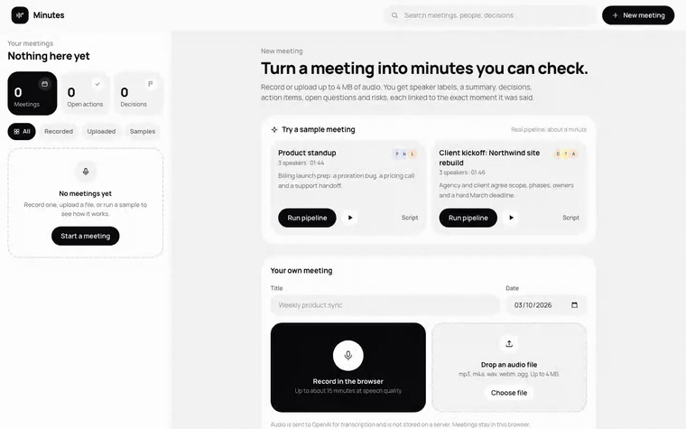
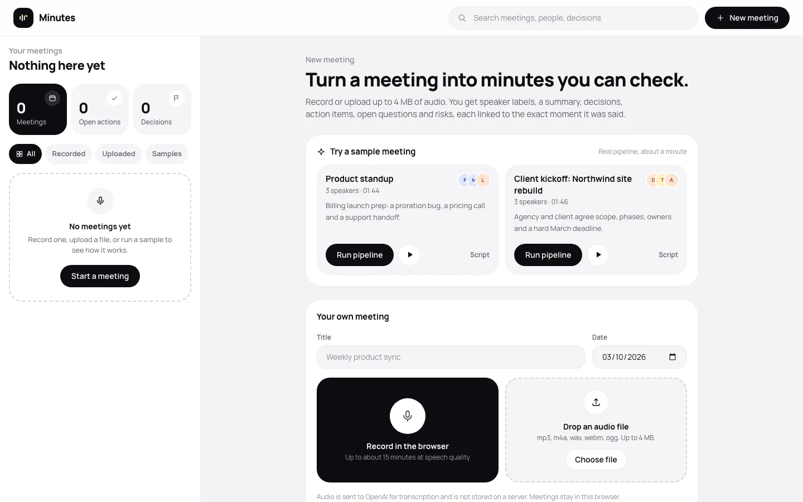
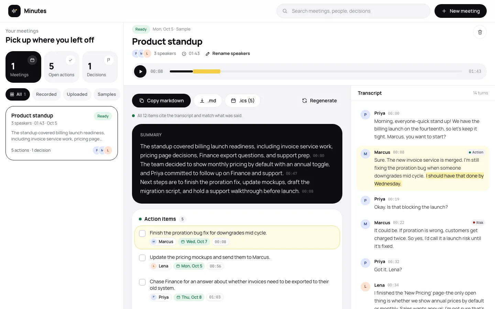

# Minutes

Meeting minutes from recorded or uploaded audio, where every item links back to the transcript lines it came from.

**Live demo:** https://minutes-sand.vercel.app



## Why it exists

Whoever writes up a meeting often has to show where each point came from: PMs, team leads, agency account managers. Minutes records a meeting in the browser or takes an upload and returns a 3 sentence summary, decisions, action items with owners and due dates, open questions and risks. Click an item and the transcript scrolls to those lines, highlights the quoted phrase and moves the audio there.

Two sample meetings ship in `public/samples/` (a product standup and a client kickoff), so you can run the whole pipeline in one click.

## How it works

1. **Transcription with speaker labels.** `/api/transcribe` sends the audio to `gpt-4o-transcribe-diarize` with `response_format: "diarized_json"` and `chunking_strategy: "auto"`. The API needs chunking for anything over 30 seconds. The model returns many short phrases, so `normalizeSegments` merges back-to-back phrases from the same speaker into turns (at most 15 s or 320 characters, so citations stay precise) and gives each turn a stable id (`s1`, `s2`, ...).
2. **Known speakers.** The samples also send 8 second reference clips with `known_speaker_names` / `known_speaker_references`, so diarization returns real names. Your own meetings come back as `A`, `B`, `C` and you rename them. A rename updates action item owners right away, because owners are stored as the speaker label, not as a copy of the name.
3. **Structured extraction.** `/api/extract` makes one Responses API call (`gpt-5.4-mini`, low reasoning effort) with Structured Outputs through `zodTextFormat`. The prompt shows the transcript as `[s12 01:23] Name: text`. Every item has to return `segment_ids` and a short verbatim `quote`. The same call writes the follow-up email draft.
4. **Grounding checks on the model's output.** The server does not take the model's citations at face value:
   - ids are normalized (`S3`, `[s03]`, `seg 3` all become `s3`), ids that don't exist get dropped, and items left with no valid citation get removed (the UI shows how many)
   - an item's timestamp comes from the first segment it cites, never from the model
   - word overlap between the quote and the cited text gives a support score. Items under 60% get a "check source" badge. Summary sentences paraphrase on purpose, so they only need valid citations
   - due dates must be real `YYYY-MM-DD` dates. Relative days are resolved against the meeting date, and vague timing like "this week" gets no date
5. **Exports.** Copy as markdown, download `.md`, download an `.ics` file (one all-day event per dated action item, RFC 5545 escaping and 75 octet line folding), and copy the email draft.

Meetings live in `localStorage` as a list. Uploaded and recorded audio goes into IndexedDB so playback still works after a reload. Nothing is stored on a server.

### Cost and abuse controls

- Per-IP rate limits, tight by default: 3 transcriptions and 5 extractions per hour. The window starts at your first counted request, and the 429 response says when it resets. Counts live in a shared Upstash Redis database, so they hold across every serverless instance. Each check is one Lua script that increments and sets the expiry atomically, and a request over the limit is refused without being counted. If Redis is configured but unreachable, both routes return 503 rather than letting the request through. Without the Redis env vars (local dev, tests) the app counts in memory instead. The client IP comes from `x-real-ip`, then the last `x-forwarded-for` entry, because the leftmost entry can be spoofed. Addresses are normalized and IPv6 is grouped by /64, so rotating addresses inside one subscriber's range or adding a port does not get a fresh limit. The in-memory fallback is capped at 10,000 keys and evicts the least recently used ones instead of clearing all counters. Malformed limit env vars fall back to the defaults.
- A caller who is already over the limit is refused before the upload is read. Bodies are read as a stream with a hard byte cap, and the read stops once the cap is passed, even when `content-length` is missing, wrong or chunked (413). Uploads are capped at 4 MB (Vercel bodies max out near 4.5 MB), speaker references at 4 clips of 256 KB each, and file type is checked.
- Transcription is billed by audio length, not bytes, and 4 MB of low bitrate audio can hold well over an hour. So before any OpenAI call the server reads the duration from the container (`lib/audio-duration.ts`, covering WAV, MP3 by walking every frame, FLAC, Ogg, WebM including MediaRecorder files without a Duration element, and MP4/M4A including fragmented files). Audio over 20 minutes gets a 413, speaker clips over 12 seconds get a 400, and a file whose length cannot be read gets a 415.
- The whole deployment also has a daily audio budget (`DAILY_AUDIO_MINUTES`, 120 by default), counted in Redis in whole seconds under `budget:minutes:audio-seconds:<YYYY-MM-DD>`. The length is parsed from the audio container before any OpenAI call. A request reserves that length up front and gets a 503 once the budget is used. A crafted file can understate its length in the header, so after transcription the server also charges whatever extra duration OpenAI reports.
- Extraction input has a zod schema and caps on segment count, text length and body size. Every limit is checked before the OpenAI call.
- The browser recorder uses 32 kbps Opus and stops itself near the 4 MB cap.
- The OpenAI client retries twice with a timeout. Upstream errors become short user-facing messages, and a meeting that fails mid-step can be retried from that step.
- The transcript goes into the prompt as untrusted data, and the prompt tells the model to ignore instructions inside it.

Rough cost per 2 minute meeting from the token usage I measured: about 1.9k audio input tokens and 3k output tokens for transcription, plus about 1.4k input and 1.1k output tokens for extraction. That's a few cents per meeting, and transcription is most of it.

## Screenshots





A 22 second recording of one sample run is in [docs/demo.mp4](docs/demo.mp4). Transcription took about 42 seconds and extraction about 7 seconds on the live site, and both waits are cut down in the video.

## Stack

- Next.js 16 (App Router), React 19, TypeScript, Tailwind CSS 4
- OpenAI Node SDK: `gpt-4o-transcribe-diarize` for transcription with speaker labels, Responses API with Structured Outputs (`gpt-5.4-mini`) for extraction, `gpt-4o-mini-tts` for the sample audio
- zod for request and output schemas
- `localStorage` and IndexedDB for meetings and audio, nothing stored on a server
- Deployed on Vercel

## Run it

```bash
npm install
cp .env.example .env.local   # add OPENAI_API_KEY (or vercel env pull .env.local)
npm run dev                  # http://localhost:3202
npm test                     # citations, transcripts, ics, body cap, limiter, Redis counters, audio duration
npm run lint && npm run build
```

The sample audio was generated once with `gpt-4o-mini-tts`, using a different voice and style instructions for each speaker. Regenerate it with `node --env-file=.env.local scripts/generate-samples.mjs` (needs ffmpeg). The scripts live in `samples/*.json`.

## Config

| Variable | Default | What it does |
| --- | --- | --- |
| `OPENAI_API_KEY` | none | Server-side key, never sent to the browser |
| `OPENAI_MODEL` | `gpt-5.4-mini` | Model for extraction |
| `RATE_LIMIT_TRANSCRIBE` | `3` | Transcriptions per IP per window |
| `RATE_LIMIT_EXTRACT` | `5` | Extractions per IP per window |
| `RATE_LIMIT_WINDOW_MS` | `3600000` | Rate limit window, started by the first counted request |
| `DAILY_AUDIO_MINUTES` | `120` | Audio minutes per UTC day across the whole deployment, 503 after that |
| `KV_REST_API_URL`, `KV_REST_API_TOKEN` | none | Upstash Redis REST credentials for the shared counters. Set by the Vercel integration; without them counts stay in memory |

Rate limits and the audio budget are counted in Upstash Redis, so every instance sees the same numbers. The IP key is only as trustworthy as the proxy in front of the app. Vercel overwrites `x-real-ip`, but behind a proxy that passes client headers through, a caller can pick their own key.

## Related

Other small apps built on the OpenAI API:

- [Interview Coach](https://github.com/Sahilll15/interview-coach): a spoken mock interview with a report that quotes your answers. Live at https://interview-coach-seven-rose.vercel.app
- [SplitSnap](https://github.com/Sahilll15/splitsnap): split a restaurant bill from a receipt photo, exact to the cent. Live at https://splitsnap-sandy.vercel.app
- [ShipNotes](https://github.com/Sahilll15/shipnotes): cited release notes from a GitHub compare range. Live at https://shipnotes-mu.vercel.app
- [AskCSV](https://github.com/Sahilll15/askcsv): ask plain English questions about a CSV, answered with checked SQL in the browser
